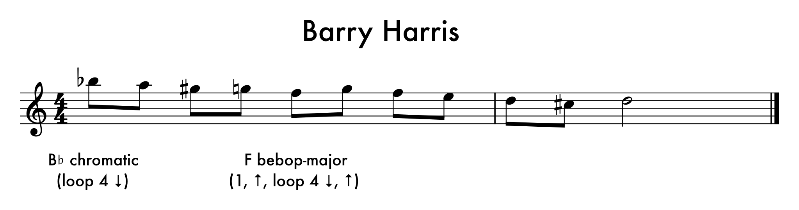
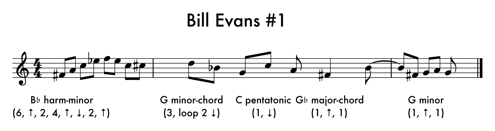
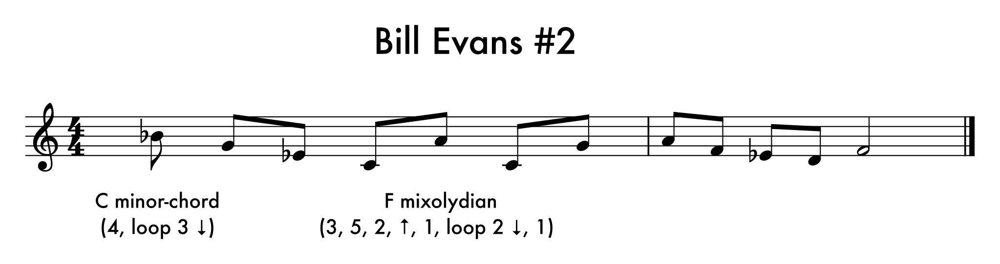
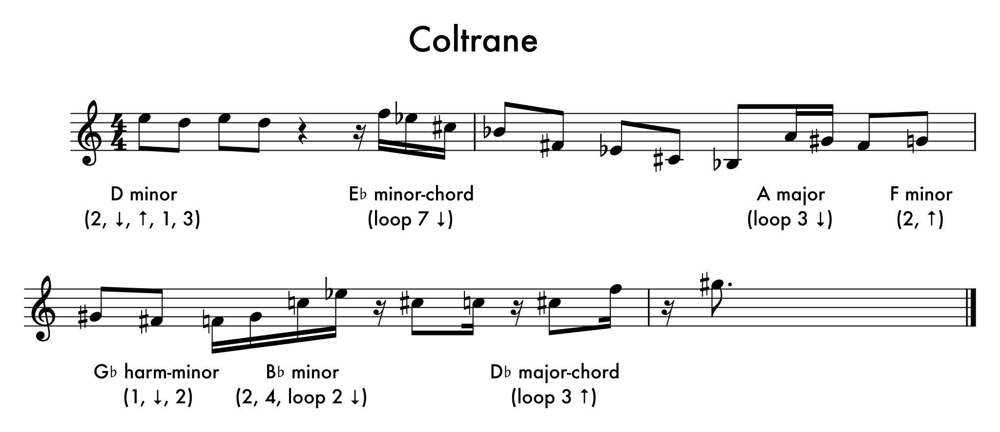

Program synthesis (library enumeration/equality saturation) for compact representation of data

```bash
git clone https://github.com/reciprocated/revel -b decon
# must have musescore binary in $PATH
python3.10 decon.py tunes/barry-harris.mid
```






